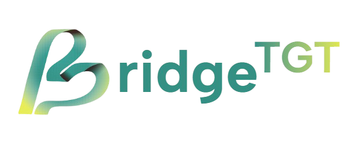

  
  
  # BridgeTGT StatusBoard
  
  **A collaborative workspace & Developer Status Board**
  
  *Streamline your team's workflow with real-time project tracking, task management, and comprehensive activity logging*

---

## 🎯 About

**BridgeTGT StatusBoard** is a comprehensive full-stack project management platform designed to help development teams track projects, manage tasks, monitor developer activities, and visualize project timelines. Built with modern web technologies, it provides an intuitive interface for team collaboration and project oversight.

The application combines powerful backend APIs with a streamline frontend interface to deliver real-time updates, and efficient workflow management for development teams of any size.

---

## ✨ Features

### 🎨 **Dashboard & Overview**

- **Real-time Project Status** - Monitor all active projects at a glance
- **Developer Activity Tracking** - See who's working on what in real-time
- **Progress Visualization** - Visual indicators for project and task completion
- **Quick Statistics** - Get instant insights into team productivity and project health

### 👥 **Developer Management**

- **Developer Profiles** - Comprehensive developer information and skills tracking
- **Role Assignment** - Flexible role-based access control
- **Team Organization** - Manage multiple developers across different projects
- **Activity History** - Track individual developer contributions and changes

### 📊 **Project & Task Management**

- **Project Creation & Tracking** - Create and monitor multiple projects
- **Task Assignment** - Assign tasks to team members with priority levels
- **Status Updates** - Real-time task status tracking (To Do, In Progress, Done)
- **Task Dependencies** - Manage task relationships and dependencies
- **Multi-assignee Support** - Assign multiple developers to complex tasks

### 📅 **Gantt Chart Visualization**

- **Interactive Timeline** - Visual project and task timeline representation
- **Drag-and-Drop Scheduling** - Easily adjust task dates and durations
- **Progress Tracking** - Visual progress indicators on timeline
- **Critical Path Analysis** - Identify bottlenecks and dependencies

### 📝 **Activity Log & Audit Trail**

- **Comprehensive Change Tracking** - Every action is logged and auditable
- **Advanced Filtering** - Filter by date, user, action type, and entity
- **Export Capabilities** - Export logs for reporting and compliance
- **Real-time Updates** - Live activity feed with WebSocket support

### 🔐 **Authentication & Security**

- **GitHub OAuth Integration** - Seamless login with GitHub accounts
- **Company Access Key** - Traditional key-based authentication
- **Session Management** - Secure session handling and validation
- **Role-based Permissions** - Control access based on developer roles

### 🔄 **Real-time Features**

- **WebSocket Integration** - Live updates across all connected clients
- **Instant Notifications** - Get notified of important changes
- **Collaborative Environment** - Multiple users can work simultaneously

---

## 🏗️ System Architecture

  
  
<em>High-Level System Architecture</em>

### Architecture Components

**Frontend Layer (Vue.js)**

- Single Page Application (SPA) built with Vue 3 Composition API
- State management with Pinia
- Real-time updates via Socket.IO client
- Responsive UI with TailwindCSS and PrimeVue components

**Backend Layer (Node.js/Express)**

- RESTful API with Express.js framework
- JWT-based authentication and session management
- Real-time communication with Socket.IO server
- Comprehensive logging and error handling

**Database Layer (MySQL)**

- Relational database for structured data storage
- Optimized queries and indexing
- Transaction support for data integrity

**Deployment Layer**

- Docker containerization for consistent environments
- Docker Compose for multi-container orchestration
- Nginx for production serving (frontend)

  
  
<em>Application Data Flow</em>

---

## 🗄️ Database Schema

  
  
<em>BridgeTGT Database Entity Relationship Diagram</em>

### Core Entities

- **`developers`** - Developer profiles and contact information
- **`roles`** - Role definitions (Frontend, Backend, Full Stack, etc.)
- **`developer_roles`** - Many-to-many relationship between developers and roles
- **`projects`** - Project information and metadata
- **`tasks`** - Task details with status, priority, and timeline
- **`task_assignees`** - Many-to-many relationship between tasks and developers
- **`change_logs`** - Comprehensive audit trail of all system changes
- **`auth_sessions`** - Active user session management

---

## 📸 Screenshots

  
  
<em>Main Dashboard - Project Overview</em>

  
  
  
<em>Gantt Chart - Project Timeline Visualization</em>

  

### API Endpoints Overview

#### Authentication

- `POST /api/auth/login` - User login (Company Access Key)
- `POST /api/auth/github` - GitHub OAuth login
- `POST /api/auth/logout` - User logout
- `GET /api/auth/validate` - Validate session

#### Developers

- `GET /api/developers` - Get all developers
- `GET /api/developers/:id` - Get developer by ID
- `POST /api/developers` - Create new developer
- `PUT /api/developers/:id` - Update developer
- `DELETE /api/developers/:id` - Delete developer

#### Projects

- `GET /api/projects` - Get all projects
- `GET /api/projects/:id` - Get project by ID
- `POST /api/projects` - Create new project
- `PUT /api/projects/:id` - Update project
- `DELETE /api/projects/:id` - Delete project

#### Tasks

- `GET /api/tasks` - Get all tasks
- `GET /api/tasks/:id` - Get task by ID
- `POST /api/tasks` - Create new task
- `PUT /api/tasks/:id` - Update task
- `DELETE /api/tasks/:id` - Delete task

#### Roles & Assignments

- `GET /api/roles` - Get all roles
- `GET /api/developer-roles` - Get developer role assignments
- `GET /api/task-assignees` - Get task assignees

#### Activity Logs

- `GET /api/change-logs` - Get all change logs (with filters)
- `GET /api/change-logs/:id` - Get specific log entry

### WebSocket Events

The application uses Socket.IO for real-time updates:

- `project:created` - New project created
- `project:updated` - Project updated
- `task:created` - New task created
- `task:updated` - Task updated
- `developer:updated` - Developer information updated
- `activity:logged` - New activity log entry

---

## 🛠️ Tech Stack

### Frontend

- **Framework:** Vue.js 3.5 (Composition API)
- **State Management:** Pinia
- **Routing:** Vue Router 4
- **UI Components:** PrimeVue, Lucide Icons
- **Styling:** TailwindCSS 4
- **Build Tool:** Vite
- **Real-time:** Socket.IO Client
- **HTTP Client:** Axios
- **Testing:** Vitest, Playwright

### Backend

- **Runtime:** Node.js 24.x
- **Framework:** Express.js 5.1
- **Database:** MySQL 8.0
- **ORM/Query Builder:** mysql2
- **Authentication:** JWT, GitHub OAuth
- **Real-time:** Socket.IO Server
- **API Documentation:** Swagger (swagger-jsdoc, swagger-ui-express)
- **Validation:** express-validator
- **Development:** Nodemon

### DevOps & Deployment

- **Containerization:** Docker
- **Orchestration:** Docker Compose
- **Web Server:** Nginx (production frontend)
- **Database Management:** phpMyAdmin
- **Version Control:** Git

---

## 🎉 Acknowledgments

Built by the Bridge Digital Transformations Interns @2025.

---

  
<strong>BridgeTGT StatusBoard</strong> - Empowering teams to build better, together.

