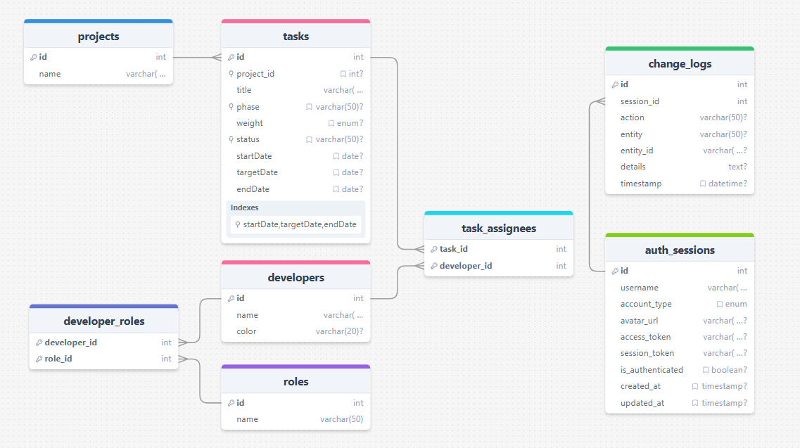

# BridgetGT Backend (Express.js)

## Project Purpose

BridgetGT Backend is a RESTful API for managing developers, projects, tasks, roles, assignments, and activity logs for a developer or organization. It supports authentication (including GitHub OAuth and Company Access Key) and provides API documentation via Swagger.

## Quick Start

### Local Development

1. Navigate to this directory:

   ```bash
   cd bridgetgt-backend-express
   ```

2. Run the setup script to configure environment variables:

   ```powershell
   .\setup-local.ps1
   ```

3. Install dependencies:

   ```bash
   npm install
   ```

4. Start the development server:
   ```bash
   npm run dev
   ```

The backend API will be available at `http://localhost:3001`

### Docker Deployment

Docker configuration is now centralized at the root level. To run with Docker:

```bash
cd ..
docker-compose up --build
```

See the root [SETUP.md](../SETUP.md) for detailed instructions.

## bridgeTGT_db ERD



## Architecture & Structure

- **Pattern:** Follows MVC (Model-View-Controller)
- **Models (`src/models/`)**: Database queries and data logic
- **Controllers (`src/controllers/`)**: HTTP request logic, validation, calls model functions
- **Routes (`src/routes/`)**: API endpoint definitions
- **Middlewares (`src/middlewares/`)**: Authentication and logging
- **Config (`src/config/`)**: Database connection
- **Swagger (`src/swagger.js`)**: API documentation

## Main Features

- Projects CRUD
- Developers CRUD
- Roles CRUD and assignment
- Tasks CRUD and assignment
- Change logs for auditing
- Session-based authentication (company key & GitHub OAuth)
- API documentation at `/api/docs`

## API Endpoints

### Projects

- `GET /api/projects` — List all projects
- `GET /api/projects/:id` — Get project by ID
- `POST /api/projects` — Create project
- `PUT /api/projects/:id` — Update project
- `DELETE /api/projects/:id` — Delete project

### Developers

- `GET /api/developers` — List all developers
- `GET /api/developers/:id` — Get developer by ID
- `POST /api/developers` — Create developer
- `PUT /api/developers/:id` — Update developer
- `DELETE /api/developers/:id` — Delete developer

### Roles

- `GET /api/roles` — List all roles
- `GET /api/roles/:id` — Get role by ID
- `POST /api/roles` — Create role
- `PUT /api/roles/:id` — Update role
- `DELETE /api/roles/:id` — Delete role

### Developer Roles

- `POST /api/developer-roles` — Assign role to developer
- `DELETE /api/developer-roles` — Remove role from developer
- `GET /api/developer-roles/:developer_id` — Get roles for a developer

### Tasks

- `GET /api/tasks` — List all tasks
- `GET /api/tasks/:id` — Get task by ID
- `POST /api/tasks` — Create task
- `PUT /api/tasks/:id` — Update task
- `DELETE /api/tasks/:id` — Delete task

### Task Assignees

- `POST /api/task-assignees` — Assign developer to task
- `DELETE /api/task-assignees` — Remove developer from task
- `GET /api/task-assignees/:task_id` — Get developers assigned to a task

### Change Logs

- `POST /api/change-logs` — Log a change
- `GET /api/change-logs` — List all change logs

### Auth

- `POST /api/auth/logout` — Logout (invalidate session)
- `GET /api/auth/sessions` — List active sessions
- `POST /api/auth/company-key` — Authenticate with company key
- `GET /api/auth/github` — GitHub OAuth redirect
- `GET /api/auth/github/callback` — GitHub OAuth callback
- `GET /api/auth/github/exchange` — Exchange GitHub code for token

## Good Practices

- Separation of concerns (MVC)
- Input validation
- Environment variables
- Swagger documentation
- Activity logging
- Async/await for DB operations

## Areas for Improvement

- Centralized error handling
- Add tests
- Security enhancements (rate limiting, input sanitization)
- Restrict CORS in production
- Remove duplicate route registration
- Use proper logging library
- Add database migration scripts
- Consider TypeScript for type safety
- Add API versioning

## Summary

- **Purpose:** Manage developers, projects, tasks, roles, assignments, and logs
- **Architecture:** MVC
- **Improvements:** Testing, error handling, security, logging, migrations

---

For detailed API documentation, visit `/api/docs` when the server is running.
